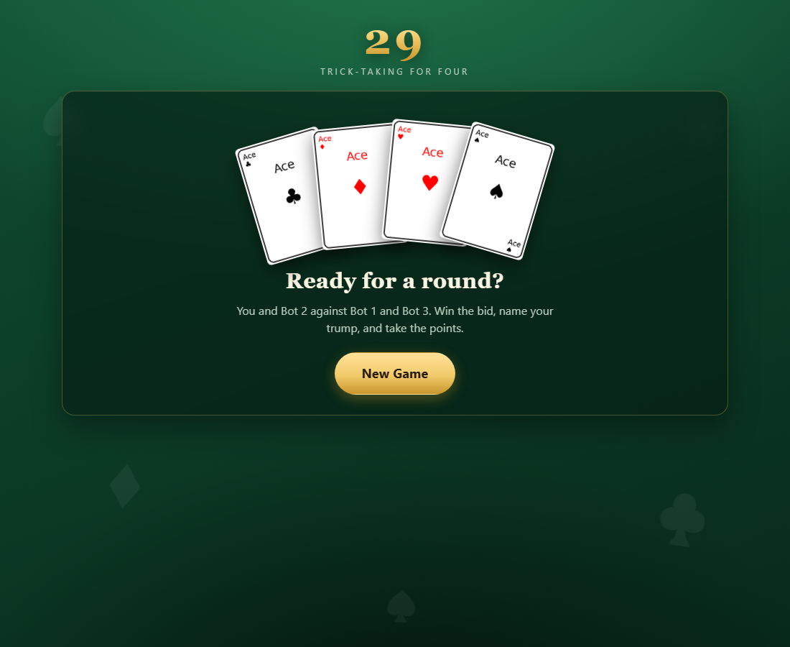
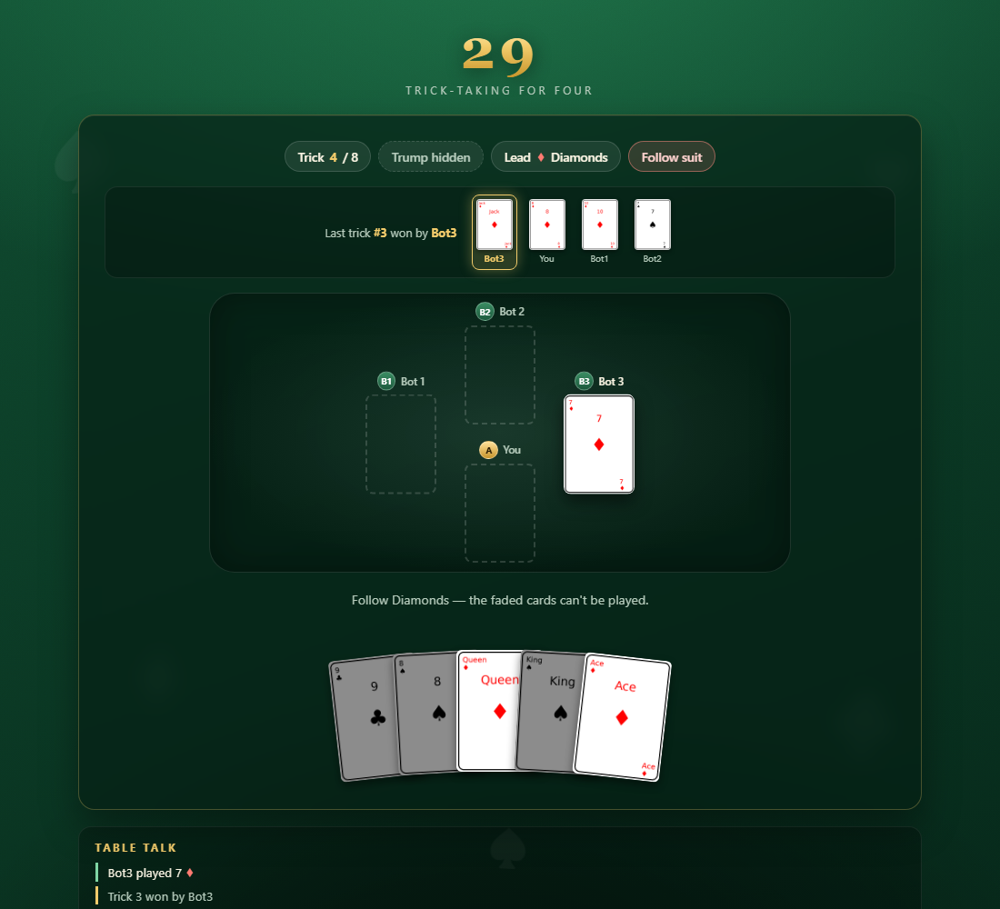

# 29 Card Game

[Demo](https://two9cardgame-skj7.onrender.com/)

A browser-based implementation of **29**, the four-player Indian trick-taking card game.

Play as a human against three bots, bid for the contract, secretly choose trump, dig when necessary, and fight through eight tricks to reach your bid.






---

## 🎮 Features

* **Complete 29 round flow**

  * Player name entry
  * Bidding
  * Secret trump selection
  * Trump digging
  * Eight tricks
  * Round scoring

* **🤖 Heuristic AI opponents**

  * Bots evaluate their hands when bidding
  * Bots follow suit and trump rules
  * Bots track game state when selecting cards
  * Bots can independently decide when to dig

* **🃏 Real card gameplay**

  * 32-card deck
  * Correct 29 card ranking
  * Follow-suit enforcement
  * Hidden trump
  * Last-trick bonus

* **🎬 Move replay**

  * Each trick is replayed card-by-card
  * Bot moves are shown sequentially
  * Trick winner is displayed
  * Replay can be skipped

* **✨ Animated interface**

  * Cards deal into a fanned hand
  * Cards animate from player seats
  * Played cards lift from the hand
  * Page transitions
  * Win animation
  * Respects `prefers-reduced-motion`

* **📱 Responsive**

  * Works on desktop and mobile
  * Table and hand scale for smaller screens

* **🖥️ Two interfaces**

  * Flask browser interface
  * Terminal interface
  * Both use the same underlying game engine

* **🧪 Automated testing**

  * Unit tests
  * Headless full-game simulation
  * Follow-suit validation
  * Crash detection

---

# 🧠 How 29 Works

### Deck

The game uses **32 cards**.

Cards are ranked from highest to lowest:

```text
Jack > 9 > Ace > 10 > King > Queen > 8 > 7
```

Card points:

| Card  | Points |
| ----- | -----: |
| Jack  |      3 |
| 9     |      2 |
| Ace   |      1 |
| 10    |      1 |
| King  |      0 |
| Queen |      0 |
| 8     |      0 |
| 7     |      0 |

The cards contain **28 points** in total.

The team that wins the final trick receives **1 additional point**, giving the game its name:

> **29 points**

---

## 👥 Teams

The four players are divided into two teams:

```text
You       + Bot 2
   VS
Bot 1     + Bot 3
```

Partners sit opposite each other.

---

## 💰 Bidding

Each player receives four cards before the auction.

Players bid based on the strength of their hand.

The highest bidder:

1. Wins the contract
2. Chooses the trump suit
3. Receives the remaining four cards

The human player can either:

```text
Pass
```

or make a bid greater than the current bid.

---

## 🃏 Hidden Trump

Trump remains hidden until somebody decides to **dig**.

If a player:

* cannot follow the lead suit,
* has not yet seen trump,
* and chooses to dig,

the trump suit becomes visible to everyone.

From that point onward:

```text
Trump > Lead Suit
```

If the player digs and holds a trump card, they must play trump on that turn.

Bots can also independently decide to dig.

---

## 🏆 Tricks

Players must follow the lead suit whenever possible.

If trump has been revealed:

```text
Trump card
    ↓
beats
    ↓
Any non-trump card
```

If nobody plays trump, the highest card of the lead suit wins.

The player who wins the trick leads the next one.

There are **eight tricks** in every round.

---

## 📊 Scoring

After all eight tricks:

```text
Team points + final trick bonus
```

are compared against the bidding team's contract.

If the bidding team reaches its bid, it wins the round.

Otherwise, the opposing team wins.

---

# 🏗️ Architecture

The project separates the game engine from the Flask interface.

```text
                     ┌─────────────────┐
                     │   Flask / Web   │
                     │      UI        │
                     └────────┬────────┘
                              │
                              ▼
                     ┌─────────────────┐
                     │  Round Engine   │
                     │  play_game()    │
                     └────────┬────────┘
                              │
             ┌────────────────┼────────────────┐
             ▼                ▼                ▼
        ┌──────────┐    ┌──────────┐    ┌──────────┐
        │  Rules   │    │ Players  │    │ Scoring  │
        └──────────┘    └────┬─────┘    └──────────┘
                              │
                              ▼
                         ┌─────────┐
                         │ Bot AI  │
                         └─────────┘
```

The core game engine does **not depend on Flask**.

This allows the same engine to power both:

```text
Browser game
      +
Terminal game
```

---

# ⚙️ Generator-Based Game Engine

The original game was implemented as a blocking terminal loop using `input()`.

That approach doesn't work well with HTTP because a web request should not remain blocked while waiting for a player's next move.

The solution is a generator:

```python
play_game()
```

located in:

```text
algorithm/round_flow.py
```

The generator yields an event whenever something happens.

For example:

```text
need_name
need_bid
need_trump
need_dig_choice
need_card
round_result
```

The Flask application pauses the generator, renders the appropriate screen, and resumes it when the player submits an answer.

### Event flow

```text
                 play_game()
                     │
                     ▼
               ┌───────────┐
               │ need_bid  │
               └─────┬─────┘
                     │
               Browser UI
                     │
                     ▼
               Player submits
                     │
                     ▼
               resume generator
                     │
                     ▼
               next game event
```

This keeps the **game engine independent from the UI**.

---

# 🌐 Web Application

The Flask application stores the generator and currently pending event in memory.

### Routes

| Route             | Purpose                        |
| ----------------- | ------------------------------ |
| `GET /`           | Render the current game screen |
| `POST /new-game`  | Start a new round              |
| `POST /name`      | Submit player name             |
| `POST /bid`       | Submit bid                     |
| `POST /trump`     | Select trump                   |
| `POST /dig`       | Choose whether to dig          |
| `POST /play-card` | Play a card                    |

Invalid input does not advance the game.

Instead, the same event is yielded again with an error message.

---

# 🎬 Replay System

After a move, the server converts game events into replay frames.

For example:

```text
Player card
     ↓
Bot 1 card
     ↓
Bot 2 card
     ↓
Bot 3 card
     ↓
Trick winner
```

The browser then displays each frame sequentially.

Replay timing is centralized through:

```python
REPLAY_MS
```

The replay is server-rendered, meaning refreshing the page can replay the most recent move.

A **Skip** button allows the player to immediately finish the replay.

---

# 🎨 Front End

The frontend deliberately avoids a JavaScript framework.

It uses:

```text
Flask
Jinja2
HTML
CSS
Vanilla JavaScript
```

### Card rendering

Cards follow this naming convention:

```text
static/<Rank>_of_<Suit>.png
```

For example:

```text
Ace_of_Diamonds.png
King_of_Hearts.png
Jack_of_Spades.png
```

### CSS

The table, card animations, hand fan, seat positions, and transitions are implemented in:

```text
static/CSS/style.css
```

CSS custom properties such as:

```text
--i
--n
--order
```

control card positioning and animation timing.

### JavaScript

`static/JS/app.js` provides progressive enhancement:

* Card transitions
* Page fade animations
* Replay playback
* Double-submit prevention
* Scroll restoration

The game still works without JavaScript because the underlying controls are normal HTML forms.

---

# 📁 Project Structure

```text
29cardgame/
│
├── app.py
│
├── algorithm/
│   ├── __init__.py
│   ├── game.py
│   ├── round_flow.py
│   │
│   └── initialize_cards/
│       ├── card.py
│       ├── player.py
│       ├── bot.py
│       ├── bidding.py
│       └── helpers.py
│
├── data/
│   ├── card_value.json
│   └── card_points.json
│
├── static/
│   ├── cards/
│   ├── CSS/
│   │   └── style.css
│   └── JS/
│       └── app.js
│
├── templates/
│   ├── base.html
│   ├── index.html
│   └── _partials/
│
├── tests/
│   └── ...
│
├── docs/
│   └── screenshots/
│
├── pyproject.toml
└── uv.lock
```

---

# 🚀 Quick Start

## Requirements

* Python **3.12+**
* [`uv`](https://docs.astral.sh/uv/)

## Install

Clone the repository:

```bash
git clone https://github.com/CodingTech2O/29cardgame.git
cd 29cardgame
```

Run the application:

```bash
uv run python app.py
```

Then open:

```text
http://127.0.0.1:5000
```

### Environment variables

Optionally create:

```text
.env
```

from:

```text
.env.example
```

and configure:

```text
SECRET_KEY=your-secret-key
```

The application uses this key to sign Flask forms.

---

# 🖥️ Terminal Version

The browser is not the only way to play.

The same game engine can be launched from the terminal:

```bash
uv run python -c "from algorithm import main_game; main_game()"
```

This is useful for:

* debugging
* testing game logic
* experimenting with bot behaviour
* running simulations

---

# 🧪 Testing

Run the unit tests:

```bash
uv run --with pytest python -m pytest
```

Run the headless game harness:

```bash
uv run python -m tests.harness 200 0
```

The harness can play complete games automatically.

For example:

```text
200 games
     ↓
Game engine
     ↓
Bots + scripted player
     ↓
Rule validation
     ↓
Crash detection
```

The harness specifically checks for issues such as:

* Game crashes
* Invalid card plays
* Follow-suit violations
* Broken game-state transitions

This also exercises the same generator used by the web application.

---

# 🤖 Bot AI

The bots currently use a **heuristic decision system**.

The bot considers information such as:

* Cards in its hand
* Card values
* Lead suit
* Trump
* Previously played cards
* Available cards
* Current trick
* Game state

The AI is implemented primarily in:

```text
algorithm/initialize_cards/bot.py
```

The current implementation is intentionally heuristic rather than machine-learning based.

This makes the decision process deterministic and inspectable while keeping the project lightweight.

---

# 🔬 Future Improvements

The project is currently focused on building a reliable game engine and playable interface.

Potential future work includes:

### AI

* [ ] Improve bot decision-making
* [ ] Reduce duplicated heuristic branches
* [ ] Add multiple difficulty levels
* [ ] Add card-counting strategies
* [ ] Experiment with Monte Carlo simulation
* [ ] Experiment with Minimax / Expectimax
* [ ] Benchmark different bot strategies

### Simulation

* [ ] Automated thousands-of-game simulations
* [ ] Bot win-rate statistics
* [ ] Strategy comparison
* [ ] Game replay files
* [ ] AI performance dashboard

### Engineering

* [ ] Increase unit-test coverage
* [ ] Add property-based testing
* [ ] Add type checking
* [ ] Add linting
* [ ] Add GitHub Actions CI
* [ ] Improve multiplayer/state management

### Web

* [ ] Persistent player statistics
* [ ] Game history
* [ ] Replay previous games
* [ ] Improved mobile UI
* [ ] Multiplayer support

---

# ⚠️ Known Limitations

### Single shared game

The current application stores game state in module-level variables.

Therefore:

> Everyone connected to the same server shares the same game.

The application is intended as a development/personal deployment rather than a production multiplayer server.

---

### All-pass rounds

If all players pass, the current implementation continues the round without a trump suit rather than redealing.

---

### Bid limits

Bids above 28 are currently accepted even though they cannot be achieved.

---

### Digging

The must-play-trump rule applies only to the turn on which a player digs, matching the behaviour of the original terminal implementation.

---

### Bot testing

The bot AI is exercised by the headless game harness, but much of the heuristic logic does not yet have dedicated unit tests.

---

# 🛠️ Tech Stack

| Technology | Purpose                                    |
| ---------- | ------------------------------------------ |
| Python     | Game engine                                |
| Flask      | Web server                                 |
| Jinja2     | HTML rendering                             |
| HTML/CSS   | User interface                             |
| JavaScript | Progressive enhancement & replay           |
| pytest     | Automated testing                          |
| uv         | Python environment & dependency management |
| JSON       | Card configuration                         |

---

# 📌 Project Goals

This project is more than a browser implementation of a card game.

The goal is to explore:

* Object-oriented Python
* Game-state management
* Rule engines
* Heuristic AI
* Generator-based program flow
* HTTP request/state handling
* Automated game simulation
* Testing complex state transitions
* Browser UI without a frontend framework

---


## Built with Python 🐍

A small card game turned into an unnecessarily complicated exercise in **game theory, state machines, AI, Flask, testing, and debugging**.

Exactly how software projects are supposed to spiral out of control.
